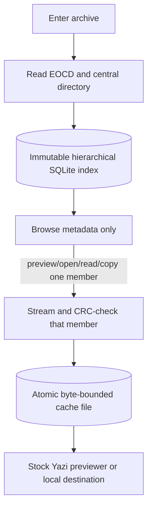

# archive-vfs.yazi

`archive-vfs` mounts large archives as read-only directory trees inside Yazi.
It needs no FUSE, root privileges, service, or full extraction. ZIP and ZIP64
are the first supported formats; the helper has a format backend boundary so
later releases can add tar, 7z, and other archive families without renaming the
plugin.

The first visit reads the ZIP end records and central directory into a compact
SQLite hierarchy. A member is decompressed only when Yazi reads, previews,
opens, or copies it. Offset reads reuse an atomically published local cache
file, and a byte-bounded cross-process LRU evicts only inactive files.

> [!IMPORTANT]
> The custom VFS API is experimental. Version 0.1 supports and is tested against
> Yazi 26.9.1. It deliberately rejects older releases rather than claiming
> compatibility with an API shape that was not tested.

## Current status

- ZIP and ZIP64, stored and deflated members
- Nested, implied, and explicit empty directories
- Stock Yazi image, JSON, and code previews through lazy backing files
- Normal sorting, filtering, selection, navigation, copy, and opener paths
- Configurable cache, concurrency, safety limits, decoding, logging, and index
  persistence
- Deterministic duplicate behavior: the last central-directory record wins
- Read-only failures for every mutation operation

No other archive format is enabled in 0.1. The project name describes the
stable direction, not a claim of format support that does not exist yet.

## Install

Requirements are Yazi 26.9.1+, stable Rust 1.85+, and `chmod`/`touch` for copied
metadata. Everything is installed in the user's home directory.

```sh
mkdir -p ~/.config/yazi/plugins/archive-vfs.yazi && curl -fsSL https://github.com/Red-Eyed/archive-vfs.yazi/archive/refs/heads/main.tar.gz | tar -xz -C ~/.config/yazi/plugins/archive-vfs.yazi --strip-components=1 && ~/.config/yazi/plugins/archive-vfs.yazi/scripts/install.sh
```

Alternatively, install from a Git checkout:

```sh
git clone https://github.com/Red-Eyed/archive-vfs.yazi.git ~/.config/yazi/plugins/archive-vfs.yazi
~/.config/yazi/plugins/archive-vfs.yazi/scripts/install.sh
```

Until the public repository exists, the equivalent local plugin layout is
`~/.config/yazi/plugins/archive-vfs.yazi/main.lua`. The install script builds
with `cargo --locked`, installs only `archive-vfs-helper` to `~/.local/bin`,
checks Yazi's version, and never edits Yazi configuration. Override the binary
location with `ARCHIVE_VFS_BIN_DIR`; if it is not on `PATH`, set
`ARCHIVE_VFS_HELPER` to the executable path.

Add `~/.config/yazi/vfs.toml`:

```toml
[archive.local]
kind = "mount"
run = "archive-vfs"
```

Add these sections to `~/.config/yazi/yazi.toml`:

```toml
[plugin]
prepend_fetchers = [
  { url = "archive://*", run = "archive-vfs", prio = "high", group = "mime" },
]
prepend_preloaders = [
  { url = "archive://*", run = "archive-vfs" },
]
prepend_previewers = [
  { url = "archive://*", run = "archive-vfs" },
]
```

Add the normal directory-enter key adapter to `~/.config/yazi/keymap.toml`:

```toml
[[mgr.prepend_keymap]]
on = [ "l" ]
run = "plugin archive-vfs"
desc = "Enter a directory or supported archive"

[[mgr.prepend_keymap]]
on = [ "<Enter>" ]
run = "plugin archive-vfs open"
desc = "Open local files or materialized archive members"

[[mgr.prepend_keymap]]
on = [ "o" ]
run = "plugin archive-vfs open"
desc = "Open local files or materialized archive members"
```

`init.lua` is not required. These snippets are also the exact isolated config
used by `scripts/manual-test.sh`.

## Use

Hover a `.zip` or `.zipx` and press `l`. The archive root appears in the normal
file list. Navigate, select, filter, sort, preview, copy, and open members as
usual. Press `h` to leave the mount and return to the archive's containing
directory.

The `Enter`/`o` adapter resolves selected archive members to lazy cache paths
before delegating back to Yazi's normal opener matching. Local files are passed
through unchanged.

The enter adapter probes both the configured extension and file signature. It
does nothing to unrelated regular files and preserves Yazi's normal directory
entry behavior.

## How lazy access works



An index identity contains the canonical archive path, size, modification and
change timestamps, device/inode where available, and a digest of the final 128
KiB. Replacing an archive therefore creates a new index and member namespace.
Short-lived helpers reopen the immutable SQLite index; no daemon can outlive
Yazi.

Concurrent first readers serialize on one member lock. The winner streams to a
partial file and renames only after size and CRC verification. Readers retain a
shared lease, while eviction uses non-blocking exclusive locks and skips active
files. The default member-cache target is 2 GiB.

See [architecture](docs/architecture.md), [configuration](docs/configuration.md),
and [security](docs/security.md) for the full contracts.

## Tests

```sh
cargo fmt --all --check
cargo clippy --all-targets --all-features -- -D warnings
cargo test --all-targets --all-features
lua tests/plugin_entry.lua
tests/install_integration.sh
lua -e 'assert(loadfile("main.lua"))'
scripts/manual-test.sh
```

The automated suite generates its archives at runtime. It covers stored and
deflated entries, ZIP64 metadata and ZIP64 end records, nested/implied/empty
directories, duplicates, Unicode and malformed names, shell metacharacters,
traversal, corrupt central/member data, CRC failure, unsupported and encrypted
members, identity invalidation, concurrent reads, automatic LRU eviction,
partial cleanup, offset reads, local copy, 100,000 direct children, and a
sparse central directory beyond 4 GiB. No large binary fixture is committed.

The manual harness creates a real PNG, JSON, text, and Rust source fixture,
starts the installed Yazi in an isolated temporary config, and asks the tester
to verify the terminal image protocol, highlighted previews, copy, and leave
navigation.

## Benchmarks

```sh
scripts/benchmark.sh
ARCHIVE_VFS_BENCH_ENTRIES=1000000 scripts/benchmark.sh
```

Representative release-profile results are in [benchmarks](docs/benchmarks.md).
On the development machine, 100k entries indexed in 703 ms and a cached full
root listing took 10.4 ms. One million entries indexed in 6.99 s and listed in
109.9 ms. First/repeated 64 KiB member access was about 9.2/1.7 ms. A logically
100 GiB sparse ZIP64 with a tiny central directory indexed and listed in 0.58
ms, demonstrating that archive byte length is not scanned linearly.

## Limitations

- Yazi 26.9.1 requires `ReadDir` to return every direct child in one Lua table;
  there is no pagination. Nested archives remain efficient, but one million
  direct children necessarily allocate one million Lua entries. The measured
  Rust-side resident size was 92 MiB before Yazi/Lua's additional allocation.
- MIME assignment is extension-based for the common image, JSON, text, and
  source formats listed in `main.lua`. Unknown members use Yazi's file-type
  summary after lazy materialization.
- Stock image/JSON/code previewers and normal openers receive a real cached
  path. Third-party plugins that deliberately reinterpret the original VFS URL
  or retain a path after Yazi's operation has ended may need a small adapter.
- Image preloading may materialize nearby images that Yazi schedules, but the
  member cache remains byte-bounded and extraction concurrency is capped.
- Multi-disk ZIP, encrypted entries, and compression methods other than stored
  and deflate are rejected. ZIP symlink records are exposed as ordinary member
  data, never followed as links.
- Cache entries larger than `max_cache_bytes` remain only while actively
  leased and are removed after release. Increase the cache bound before using
  an external opener on such a member.

## Troubleshooting

`No such VFS service: archive://local` means `vfs.toml` is absent, was loaded
from a different `YAZI_CONFIG_HOME`, or Yazi is older than 26.9.1.

`archive-vfs-helper` not found means `~/.local/bin` is missing from `PATH`.
Set `ARCHIVE_VFS_HELPER=/absolute/path/to/archive-vfs-helper` to verify the
binary location without changing plugin source.

Run Yazi with `YAZI_LOG=debug` to record plugin entry, helper probe, and VFS
provider operations in `$XDG_STATE_HOME/yazi/yazi.log`, or
`~/.local/state/yazi/yazi.log` when `XDG_STATE_HOME` is unset. Helper launch
failures and rejected `.zip` or `.zipx` archives also produce visible Yazi
notifications.

Safety-limit errors identify the configured member-size or compression-ratio
boundary. Change those values deliberately in `archive-vfs.toml`; do not
disable them globally for one untrusted archive.

If an interrupted process leaves partials, run:

```sh
archive-vfs-helper cache-clean
archive-vfs-helper cache-prune
```

Set `log_level = "debug"` temporarily for helper diagnostics. Protocol bytes
remain on stdout and diagnostics remain on stderr.

## Uninstall

```sh
rm -r ~/.config/yazi/plugins/archive-vfs.yazi
rm ~/.local/bin/archive-vfs-helper
```

Remove the three `archive-vfs` snippets from `vfs.toml`, `yazi.toml`, and
`keymap.toml`. After all Yazi sessions are closed, plugin-created data can be
removed independently:

```sh
rm -r ~/.cache/archive-vfs/members
rm -r ~/.cache/archive-vfs/indexes
```

Review non-default `cache_dir` and `index_dir` values first. Indexes contain
metadata only; member cache files are lazily extracted copies.

## Development and releases

The default branch follows semantic versioning. CI runs formatting, strict
Clippy, the full generated-fixture test suite, Lua parsing, and ShellCheck on
Linux and macOS. A `vX.Y.Z` tag builds static musl helper archives for Linux
x86_64 and aarch64 and attaches SHA-256 files to the GitHub release.

See [CHANGELOG.md](CHANGELOG.md). Licensed under the [MIT License](LICENSE).
