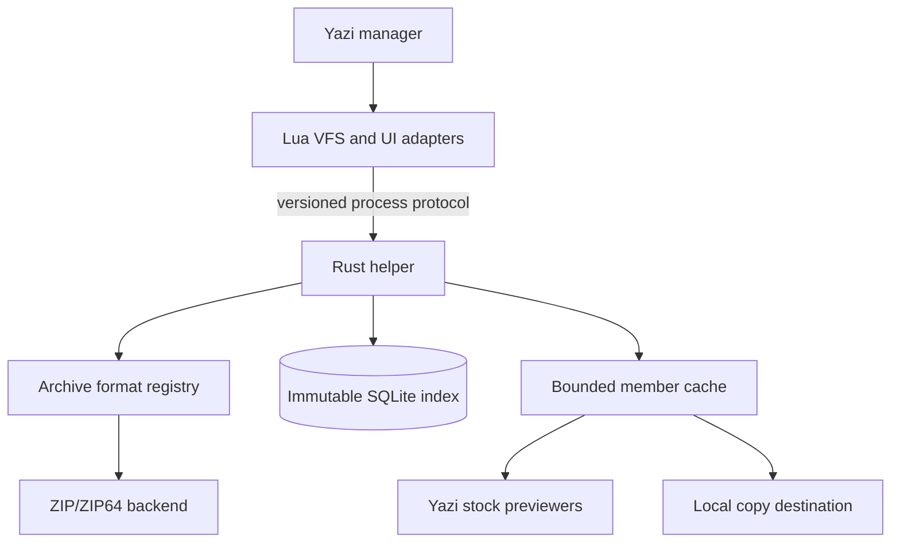

# Archive VFS Architecture

- **Author**: Vadym Stupakov <vadim.stupakov@gmail.com>
- **Status**: Approved
- **Created**: 2026-09-04
- **URL**: https://github.com/Red-Eyed/archive-vfs.yazi/blob/main/docs/architecture.md

## Objective

Browse large archives as read-only directory trees in Yazi while decompressing
only the members that Yazi or the user actually reads.

## Background

Dataset archives can be tens or hundreds of gigabytes and can contain hundreds
of thousands of images and metadata files. Fully extracting one duplicates the
dataset and delays inspection. Repeatedly parsing and sorting the archive's
complete member list is also too expensive for cursor-driven previews.

Yazi 26.8.15 introduced custom VFS mount providers. A mount provider can map a
local archive path to virtual members without FUSE, elevated privileges, or a
system service. The API remains experimental, so compatibility is tested
against named Yazi releases rather than assumed from version numbers.

## Goals

- Preserve ordinary Yazi navigation, sorting, filtering, selection, preview,
  copy, and open workflows wherever the current VFS API permits.
- Read only the end records and central directory when first indexing a ZIP.
- Keep index and member-cache memory bounded independently of archive size.
- Make corrupt and malicious archive input fail closed with useful errors.
- Allow future archive formats to reuse the VFS, cache, and preview layers.

## Non-goals

- Archive mutation, including create, write, rename, remove, and links.
- FUSE mounts or paths visible to programs outside Yazi.
- Transparent support for arbitrary third-party previewers that insist on the
  original archive-member path before the member has been materialized.
- Instant listing of directories with millions of direct children. Yazi 26.9.1
  requires a provider to return the complete directory as one Lua table.
- Multi-disk ZIP archives.

## Architecture

The Lua layer translates Yazi URLs and jobs but contains no archive parsing or
cache policy. The Rust helper owns untrusted-input handling and exposes a
versioned command protocol. Each archive backend probes a file, streams an
index into a format-neutral hierarchy, and extracts one identified member to a
writer. The cache and protocol depend on this narrow contract rather than on
ZIP-specific types.

## Archive Backend Contract

An archive backend provides three operations:

1. `probe` determines whether a local file is supported without trusting its
   extension alone.
2. `index` streams normalized entries in archive order. It must not retain a
   second complete copy after an entry has been accepted by the index sink.
3. `extract` streams one entry selected by its stable archive-local identifier.

Backends return normalized metadata and typed errors. They do not know Yazi
URLs, SQLite schemas, cache paths, preview types, or destination policy.

## ZIP Indexing

The ZIP backend searches only the maximum EOCD window at the end of the file,
then follows ZIP64 records when sentinel values require them. It validates the
declared central-directory bounds before iterating records sequentially.

The SQLite index is immutable after atomic publication. Nodes are hierarchical:
each row stores only its parent identifier and one filename component, avoiding
full-path duplication for every descendant. A unique `(parent_id, name)` key
makes metadata lookup proportional to path depth. Parent directories absent
from the central directory are synthesized as entries arrive.

Archive identity includes the canonical path, size, nanosecond modification
time, device, inode, change time where available, and a bounded tail digest.
Building uses a per-identity lock and a temporary database followed by rename.
Readers never observe a partial index.

When multiple central-directory entries normalize to the same virtual path,
the last entry wins. This matches common ZIP lookup behavior and avoids
inventing filenames. Earlier duplicates remain inaccessible and the helper
reports their count in index diagnostics.

## Virtual Paths and Filename Decoding

Path handling occurs before indexing. Absolute prefixes, drive prefixes, `.`,
empty components, and parent traversal are normalized into the virtual root.
A `..` component is encoded as a visible safe name rather than interpreted as
navigation. NUL and separator bytes that cannot form a Yazi path component are
escaped deterministically. Extraction cache paths are hashes and never contain
member-provided bytes.

The default ZIP policy follows the language-encoding flag and Unicode path
extra field, then CP437 as required by the ZIP specification. Configurable raw
and lossy policies are available for damaged archives. Invalid names produce a
stable escaped representation and never crash the provider.

## Lazy Member Cache

The first read, preview, open, or copy of a member materializes only that member
into a content-addressed cache entry. Extraction streams through a bounded
buffer, verifies the CRC, and publishes with an atomic rename.

Each member has a lock file. Extraction takes an exclusive lock and rechecks
the cache after acquisition, deduplicating concurrent requests. Readers hold a
shared lock. Eviction takes a non-blocking exclusive lock and skips busy
entries, so an active read or write is never selected. SQLite stores cache size
and last-use time; eviction is bounded by total bytes. Startup and maintenance
remove abandoned partial files whose writers no longer hold their locks.

## Preview and MIME Integration

Yazi mount URLs are virtual but are neither `local://` nor `remote://` matches
in the 26.9.1 preset MIME rules. The plugin therefore adds an archive-scheme
fetcher that assigns MIME types from member extensions without extracting all
visible entries.

The archive preview adapter materializes the hovered member, constructs a Yazi
`File` backed by that cache path, and delegates rendering to the stock image,
JSON, or code previewer. This retains Yazi's image protocol and syntax
highlighting while keeping extraction lazy. Unknown third-party previewers can
work when configured to use the backed local path; previewers that reinterpret
the original VFS URL may require an adapter.

## Provider Operations

The provider implements capabilities, directory reads, file and metadata
lookup, revalidation, canonicalization, absolute/casefold handling, read-only
open, offset reads, copy, and progressive copy. Every mutation returns a
read-only filesystem error. Capabilities advertise only progressive copy.

A keymap adapter preserves the user's normal enter key. Directories use Yazi's
built-in enter action; recognized local archives are converted to an
`archive://local/...` mount portal; unrelated files retain normal behavior.

## Process Protocol

Protocol version 1 uses explicit subcommands and binary length-prefixed output
for directory listings. Paths are passed as process arguments through Yazi's
`Command` API, never through a shell. Small scalar responses use the same
framed envelope. Standard error contains human-readable diagnostics; standard
output is protocol-only.

Short-lived helper processes are preferred over a daemon because immutable
SQLite indexes preserve the expensive work across calls without lifecycle or
orphan-process risks. Benchmarks must validate that process startup and SQLite
lookup remain acceptable.

## Security

The archive, member names, metadata, and compressed bytes are untrusted.

- Central-directory and local-header offsets use checked arithmetic and must
  remain inside the archive.
- Encrypted entries and unsupported methods return typed errors.
- Maximum uncompressed member bytes and compression ratio are checked before
  and during extraction.
- CRC mismatch prevents atomic publication.
- Cache filenames derive only from trusted hashes.
- Helper invocation never uses shell interpolation.
- Logs exclude member contents and remain quiet at the default level.

## Configuration

The helper reads `archive-vfs.toml` from Yazi's configuration directory, or the path named by
`ARCHIVE_VFS_CONFIG`. It owns cache/index directories, byte and ratio limits,
extraction concurrency, filename policy, log level, persistence, and recognized
extensions. Lua asks the helper to resolve configuration so defaults have one
source of truth.

## Alternatives Considered

- **FUSE**: rejected because it requires host support unavailable to an
  unprivileged user and expands deployment scope beyond Yazi.
- **Full extraction**: rejected because it duplicates large datasets and makes
  time and disk consumption proportional to all members rather than reads.
- **Reparse with a ZIP library per operation**: rejected because most high-level
  readers collect the complete central directory on construction.
- **Persistent daemon**: rejected initially because an immutable disk index
  retains the expensive state with simpler cleanup and no orphan lifecycle.
- **Verbose JSON index**: rejected because parsing it would create full copies
  in the helper and Lua and inflate stored names.

## Resolved Issues

### Repository and provider name

**Decision**: Use `archive-vfs.yazi` and the `archive` scheme. ZIP-specific code
is one backend so more formats can be added without renaming the project.

### Directory pagination

**Decision**: Return one table because the Yazi 26.9.1 provider contract accepts
`Vec<DirEntry>` only. Preserve nested hierarchy, avoid extra global sorting,
benchmark 100,000 direct children, and document measured limits.

### Helper lifetime

**Decision**: Use short-lived commands with immutable SQLite indexes and
cross-process file locks. Reconsider a session process only if benchmarks show
startup or query overhead is material.
